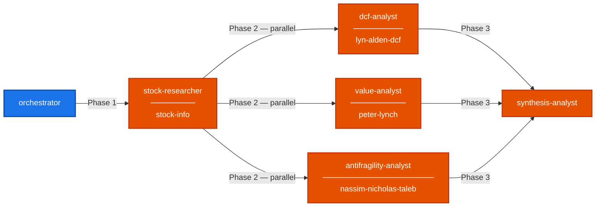
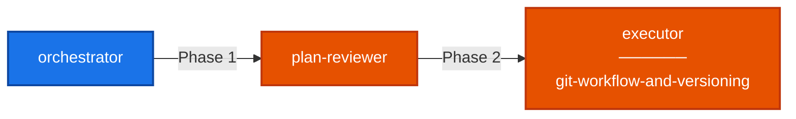
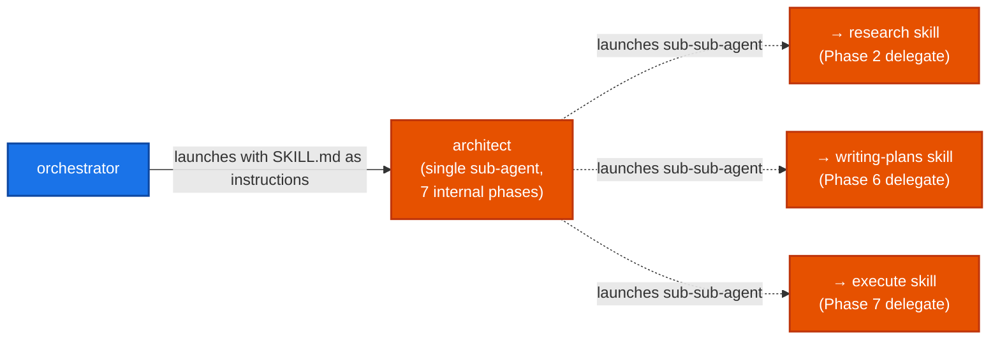
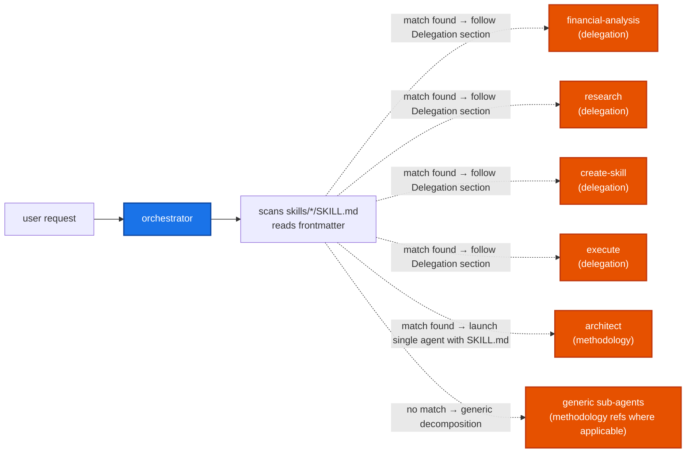

# Skill & Agent Dependency Graph

Every skill here is a **delegation skill** (has a `## Delegation` section the orchestrator follows). The orchestrator reads that section and launches sub-agents per phase.

---

## financial-analysis

**Phase 1** — `stock-researcher` carries `stock-info` to fetch all financial data.  
**Phase 2 (parallel)** — 3 agents each carry their methodology skill: `dcf-analyst` (lyn-alden-dcf), `value-analyst` (peter-lynch), `antifragility-analyst` (nassim-nicholas-taleb). All 3 read the Phase 1 output.  
**Phase 3** — `synthesis-analyst` has no skill reference, consolidates the 3 analysis files.

---

## research

```mermaid
flowchart LR
  classDef skill fill:#1a73e8,color:#fff,stroke:#0d47a1,stroke-width:2px
  classDef subagent fill:#e65100,color:#fff,stroke:#bf360c,stroke-width:2px

  orchestrator["orchestrator"]

  subgraph researchers["Phase 2 — parallel (one per source)"]
    arxiv["arxiv-researcher"]
    github["github-researcher"]
    pubmed["pubmed-researcher"]
    archive["archive-researcher"]
    web["web-researcher"]
  end

  queryRefiner["query-refiner"]
  synthesisWriter["synthesis-writer"]
  reportWriter["report-writer"]

  orchestrator -->|Phase 1| queryRefiner
  queryRefiner -->|Phase 2 — parallel| researchers
  researchers -->|Phase 3| synthesisWriter
  synthesisWriter -->|Phase 4| reportWriter

  class orchestrator skill
  class queryRefiner,arxiv,github,pubmed,archive,web,synthesisWriter,reportWriter subagent
```

**Phase 1** — `query-refiner` produces one refined query per source.  
**Phase 2 (parallel)** — one agent per source (arxiv, github, pubmed, archive, web). Each runs its source-specific tool and writes findings.  
**Phase 3** — `synthesis-writer` reads all source outputs and consolidates by theme.  
**Phase 4** — `report-writer` produces the final polished report.

---

## create-skill

```mermaid
flowchart LR
  classDef skill fill:#1a73e8,color:#fff,stroke:#0d47a1,stroke-width:2px
  classDef subagent fill:#e65100,color:#fff,stroke:#bf360c,stroke-width:2px

  orchestrator["orchestrator"]

  subgraph researchPhase["Phase 1 — parallel (full mode only)"]
    academic["academic-researcher"]
    web["web-researcher"]
    github["github-researcher<br/>(optional)"]
    historical["historical-researcher<br/>(optional)"]
  end

  synthesisWriter["synthesis-writer"]
  skillPlanner["skill-planner<br/>───────<br/>create-skill<br/>(self-ref)"]
  skillWriter["skill-writer<br/>───────<br/>create-skill<br/>(self-ref)"]

  orchestrator -->|Phase 1 — full mode| researchPhase
  researchPhase -->|Phase 2| synthesisWriter
  synthesisWriter -->|Phase 3| skillPlanner
  skillPlanner -->|Phase 4| skillWriter

  class orchestrator skill
  class academic,web,github,historical,synthesisWriter,skillPlanner,skillWriter subagent
```

Two modes: **Full mode** (above) or **Lightweight mode** (skip Phases 1-2, start at Phase 3).  

**Phase 1 (parallel)** — 2-4 research agents, depending on topic. No skill references — they use their own tools.  
**Phase 2** — `synthesis-writer` reads all research and consolidates.  
**Phase 3** — `skill-planner` carries `create-skill` (self-ref) for formatting rules. Designs the skill structure.  
**Phase 4** — `skill-writer` carries `create-skill` (self-ref) for formatting rules. Writes the final SKILL.md.

---

## execute

**Phase 1** — `plan-reviewer` reads the plan, reviews critically. No skill reference.  
**Phase 2** — `executor` carries `git-workflow-and-versioning` for branching guidance. Executes the plan step by step, delegating code tasks to sub-sub-agents as needed.

---

## architect (methodology, not delegation)

The orchestrator does **not** follow a `## Delegation` section here — instead it launches a single sub-agent with the architect SKILL.md as its instructions. That sub-agent runs 7 phases internally and launches sub-sub-agents for research, plan writing, and execution:

**Phase 1** — Deep understanding of codebase + user request. Writes `work/architect/analysis.md`.  
**Phase 2** — Launches sub-sub-agent that uses the `research` skill. Reads `work/research/report/report.md`.  
**Phase 3** — Presents options to user (decision gate).  
**Phase 4** — Writes ADR to `docs/decisions/ADR-NNN-*.md`.  
**Phase 5** — Presents ADR to user (approval gate).  
**Phase 6** — Launches sub-sub-agent that uses the `writing-plans` skill. Reads the plan file.  
**Phase 7** — Launches sub-sub-agent that uses the `execute` skill (user approval gate).

---

## orchestrator

The orchestrator is the entry point for all user requests. It:

1. Scans all `skills/*/SKILL.md` files, reads frontmatter
2. If a delegation skill matches → reads its `## Delegation` section and executes it phase by phase
3. If a methodology skill matches → launches a single sub-agent with the SKILL.md as instructions
4. If no match → decomposes generically and may reference skills as methodology for subtasks

---

## Skills with no outgoing connections

These exist in `skills/` but have no `## Delegation` section and are not referenced by any delegation skill as a target:

- `better-products-habits`
- `setup-testing-workflows`
- `update-readme`
- `fix-my-work` (has a Delegation section, but not referenced by orchestrator's current delegation skills map)
- `review-my-work` (has a Delegation section, but not referenced by orchestrator's current delegation skills map)
- `review-and-fix` (has a Delegation section, but not referenced by orchestrator's current delegation skills map)
- `stock-info` — standalone methodology, used as a tool by other skills but not dispatched directly
- `lyn-alden-dcf` — standalone methodology, used by financial-analysis but not dispatched directly
- `peter-lynch` — standalone methodology, used by financial-analysis but not dispatched directly
- `nassim-nicholas-taleb` — standalone methodology, used by financial-analysis but not dispatched directly
- `git-workflow-and-versioning` — standalone methodology, used by execute but not dispatched directly
- `writing-plans` — standalone methodology, used by architect but not dispatched directly