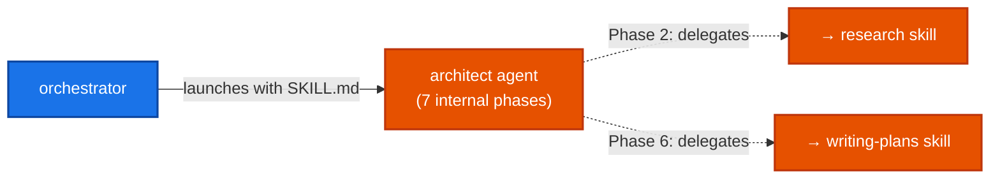
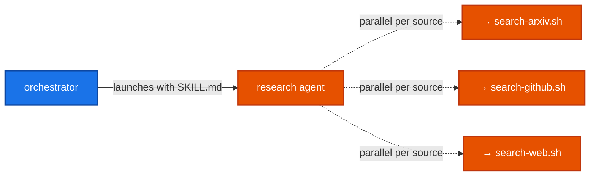
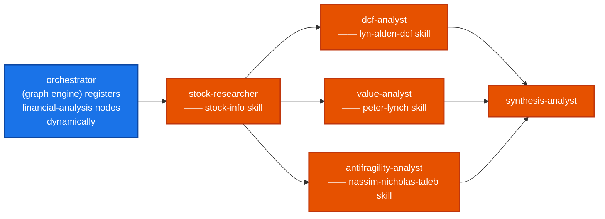
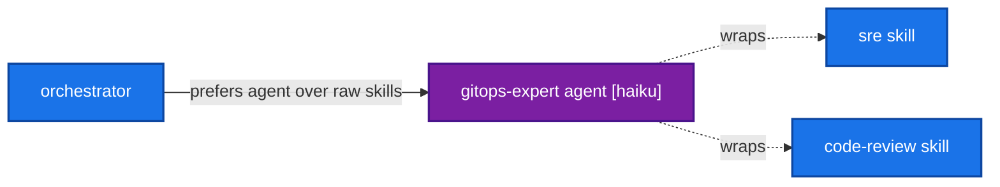

# Skill & Agent Dependency Graph

The orchestrator (`skills/orchestrator/`) is a **generic graph engine** that
chains skills and agents together based on your request. No hardcoded node
types — every execution node is registered dynamically from chain steps or
skill graphs. When you invoke it, it:

1. **Scans** all skills and agents, builds `skill_index` and `agent_index`
   with `produces` metadata
2. **Chain-planner** reads your request and builds a chain of steps. Each
   step is a skill or agent dispatch. If you describe a chain ("first research
   X, then architect a solution"), it builds those steps literally. If your
   request is generic, it shows a menu of standard chains (Fast/Safe/Thorough)
   using step roles (work, review, plan, fix) resolved to actual skills.
3. **Model assignment** — each step gets a model. Agent steps use the agent's
   frontmatter model. Skill steps use defaults (sonnet for plan, haiku for
   review/analysis, default for code).
4. **Confirm gate** shows you the full chain with model assignments. You
   approve, modify, or abort.
5. **Dynamic node registration** — the confirm node registers nodes based on
   each step's type. Methodology skills get one node. Graph skills register
   all their internal nodes (prefixed with step index). Agents get one node.
6. **Router** scans all registered nodes for "ready" status and launches them.
   Graph-internal routing happens automatically. Chain steps progress as
   nodes complete.

**Example:** Say "research transformer architectures, then architect a
solution, then review the plan." The chain-planner builds:

```
research [haiku] → architect [sonnet] → code-review [haiku] → consolidator
```

Three separate dispatches, each with its own model. No collapsing, no dedup.

Skills are **methodology** (step-by-step instructions), **graph** (node-based
workflow with triggers + routes), or **data provider** (bash scripts). Agents
wrap skills with preferred models and domain expertise — the orchestrator
prefers agents over raw skills when a match is found.

---

## orchestrator

```mermaid
flowchart LR
  classDef skill fill:#1a73e8,color:#fff,stroke:#0d47a1,stroke-width:2px
  classDef node fill:#e65100,color:#fff,stroke:#bf360c,stroke-width:2px
  classDef gate fill:#2e7d32,color:#fff,stroke:#1b5e20,stroke-width:2px

  user["user request"]
  decomposer["decomposer<br/>—— scans skills + agents,<br/>builds both indices"]
  chainPlanner["chain-planner<br/>—— builds chain from description<br/>or shows menu with roles,<br/>assigns models per step,<br/>prefers agents over skills"]
  confirm["confirm gate<br/>—— registers all nodes<br/>dynamically from chain steps,<br/>you approve the plan"]
  execNodes["dynamic nodes<br/>—— registered per step:<br/>• methodology skill: 1 node<br/>• graph skill: N nodes<br/>• agent: 1 node<br/>• fix/plan: 1 node"]
  graphInternal["graph-internal routing<br/>—— next node in graph,<br/>sink -> next chain step"]
  microLoop["chain-driven micro-loop<br/>—— work -> review -> fix -> re-review<br/>up to max_iterations"]
  human["human_input<br/>—— pauses, asks you"]
  consolidator["consolidator"]

  user --> decomposer
  decomposer --> chainPlanner
  chainPlanner --> confirm
  confirm -->|register nodes| execNodes
  execNodes --> graphInternal
  graphInternal -->|sink reached| nextChainStep["next chain step"]
  nextChainStep -->|all steps done| consolidator
  execNodes -->|review finds issues| microLoop
  microLoop -->|fix step| execNodes
  microLoop -->|maxed out| human
  microLoop -->|no issues| consolidator
  human -->|continue| execNodes
  human -->|skip/abort| consolidator

  class decomposer,chainPlanner,confirm,consolidator node
  class execNodes,graphInternal,nextChainStep,microLoop node
  class human gate
```



The chain-planner checks your request for sequential language ("first...
then...") and if found, builds a chain from those steps literally, matching
against `agent_index` first then `skill_index`. If no chain language is
detected, it shows a menu of standard chains (Fast, Safe, Thorough) using
step roles. Models are assigned per step — if an agent matches, the agent's
frontmatter `model` is used.

**No hardcoded node types.** coder, security-reviewer, test-auditor do not
exist. Every execution node is dynamically registered from chain steps or
skill graphs. The router follows whatever nodes are registered.

---

## architect (methodology)

**`produces:`** `[analysis, adr, plan]`

Launched as a single sub-agent with its SKILL.md as instructions. Runs 7
phases internally, delegating to sub-sub-agents for research and plan writing:



**Phase 1** — Deep understanding: explores codebase, writes
`work/architect/analysis.md`
**Phase 2** — Delegates to `research` skill, reads
`work/research/report/report.md`
**Phase 3** — Presents options to user (decision gate)
**Phase 4** — Writes ADR to `docs/decisions/ADR-NNN-*.md`
**Phase 5** — Presents ADR to user (approval gate)
**Phase 6** — Delegates to `writing-plans` skill, reads plan file
**Phase 7** — Presents plan, asks for execution approval

---

## research (methodology)

**`produces:`** `[research-report]`

Multi-source parallel research. Sources specified by the user (arxiv, github,
pubmed, archive, web). Each source gets a dedicated tool script in
`skills/research/tools/`.



Phases: query refinement → parallel search (one per source) → synthesis →
report.

---

## create-skill (graph)

**`produces:`** `[skill-file]`

Graph skill with two modes: **full** (research → synthesis → plan → write)
and **lightweight** (plan → write, skip research). The decomposer inside the
skill decides which mode based on the request. When the orchestrator's chain
references this skill, all its internal nodes are registered dynamically with
the `create-skill` prefix.

```mermaid
flowchart LR
  classDef skill fill:#1a73e8,color:#fff,stroke:#0d47a1,stroke-width:2px
  classDef node fill:#e65100,color:#fff,stroke:#bf360c,stroke-width:2px

  orchestrator["orchestrator\n(graph engine) registers\ncreate-skill nodes\ndynamically"]

  subgraph researchNodes["Full mode only"]
    academic["academic-researcher"]
    web["web-researcher"]
    github["github-researcher (optional)"]
    historical["historical-researcher (optional)"]
  end

  researchGate["research-gate"]
  synthesisWriter["synthesis-writer"]
  skillPlanner["skill-planner"]
  skillWriter["skill-writer"]
  cleanup["cleanup"]

  orchestrator -->|registers nodes with<br/>prefix 'N-create-skill.'| researchNodes
  researchNodes --> researchGate
  researchGate --> synthesisWriter
  synthesisWriter --> skillPlanner
  skillPlanner --> skillWriter
  skillWriter --> cleanup

  class orchestrator skill
  class academic,web,github,historical,researchGate,synthesisWriter,skillPlanner,skillWriter,cleanup node
```



In lightweight mode, the decomposer skips the research nodes and sets
`skill-planner` to `"ready"` directly.

---

## financial-analysis (graph)

**`produces:`** `[financial-data, dcf-valuation, garp-analysis, antifragility-critique, recommendation]`

Domain-specific pipeline with fixed parallelism. Three methodologies run in
parallel on the same stock data. When the orchestrator's chain references
this skill, all its internal nodes are registered dynamically.



**Data flow:** `stock-researcher` fetches data → three parallel analysts read
that data → `synthesis-analyst` consolidates all three into a recommendation.

---

## code-review (methodology)

**`produces:`** `[review-report]`

Evidence-based code review with 4 passes: structural understanding (no
comments), logic & correctness, security/performance/robustness, and style/
maintainability. Reviews under 400 lines catch 70-90% of defects — above
that, detection drops to 35%. The skill flags oversized diffs automatically.
Outputs findings with severity ratings (Critical/High/Medium/Low/Praise)
and file/line references.

---

## sre (methodology)

**`produces:`** `[audit-report]`

Full security & reliability audit pipeline. Four phases run sequentially:
security audit → reliability audit → performance audit → architecture
anti-pattern detection. Each phase uses the `code-review` skill as reference
methodology.

---

## gitops-expert (agent)

**`wraps:`** `[sre, code-review]` | **`model:`** `haiku`

Dedicated agent for auditing GitOps setups (ArgoCD, Flux). The orchestrator's
chain-planner prefers this agent over raw `sre` or `code-review` skills when
the request mentions GitOps, Kubernetes, or Git-driven deployments.



The agent's full definition is in `agents/gitops-expert.md`. When the
orchestrator selects it, it reads the `.md` file, uses its content as the
sub-agent prompt, and launches with `model: haiku`. The orchestrator maps
the agent's `tools` field to the appropriate subagent type at launch.

---

## Methodology skills (no graph)

These are single-sub-agent skills. The orchestrator launches one agent with
their SKILL.md as instructions. They are referenced by other skills as
dependencies:

| Skill | `produces` | Referenced by |
|-------|-----------|---------------|
| `lyn-alden-dcf` | `[dcf-valuation]` | financial-analysis |
| `peter-lynch` | `[garp-analysis]` | financial-analysis |
| `nassim-nicholas-taleb` | `[antifragility-critique]` | financial-analysis |
| `stock-info` | `[financial-data]` | financial-analysis, lyn-alden-dcf, peter-lynch |
| `writing-plans` | `[plan]` | architect |
| `code-review` | `[review-report]` | sre, gitops-expert |
| `sre` | `[audit-report]` | gitops-expert |
| `git-workflow-and-versioning` | `[branching-guidance]` | (convention utility) |
| `better-products-habits` | `[product-framework]` | (standalone) |
| `academic-writer` | `[academic-paper]` | (standalone) |
| `design-doc` | `[design-document]` | (standalone) |
| `latex-document` | `[latex-source]` | (standalone) |
| `setup-testing-workflows` | `[github-actions-workflow]` | (standalone) |
| `strategy-advisor` | `[strategy-review]` | (standalone) |
| `update-readme` | `[updated-readme]` | (standalone) |

---

## Agents (model-pinned wrappers)

| Agent | Wraps skills | Model | Purpose |
|-------|-------------|-------|---------|
| `gitops-expert` | sre, code-review | haiku | GitOps audit (ArgoCD/Flux) |

The orchestrator's chain-planner checks `agent_index` before `skill_index`.
When a step matches an agent, the step uses the agent's model and launches
with the agent's full definition as the prompt.

---

## Model routing

The orchestrator enforces model assignments per step. When launching a
sub-agent:

1. If the step is `type: "agent"` → use the agent's `model` from frontmatter
2. If the step is `type: "skill"` → use the chain-planner's assigned model
   (sonnet for plan, haiku for review/analysis, default for code)
3. If no model is specified → use the orchestrator's own default

This means a single chain can use different models for different steps:
`architect [sonnet] → research [haiku] → work [default]`.

---

## Chain composition

The chain-planner builds chains from the `skill_index` and `agent_index`.
Example chains:

**Fast:** work → consolidator
**Safe:** work → review → fix → consolidator
**Thorough:** plan → work → review → fix → consolidator

Step roles (work, review, plan, fix) are resolved to actual skills at build
time. If a role cannot be resolved (e.g., no review skill found), that step
is dropped with a note.

If none of these fit, describe your own chain in the request ("first X then
Y"). The chain-planner detects it and builds it directly.

The chain-planner takes descriptions literally. If you say "research then
architect then code-review", it builds exactly those three steps as separate
skill dispatches — no collapsing, no dedup. It warns about potential overlaps
but does not reorder or merge. If an agent matches a step (e.g., "audit our
GitOps" matches `gitops-expert`), the agent is used instead of the raw skill.